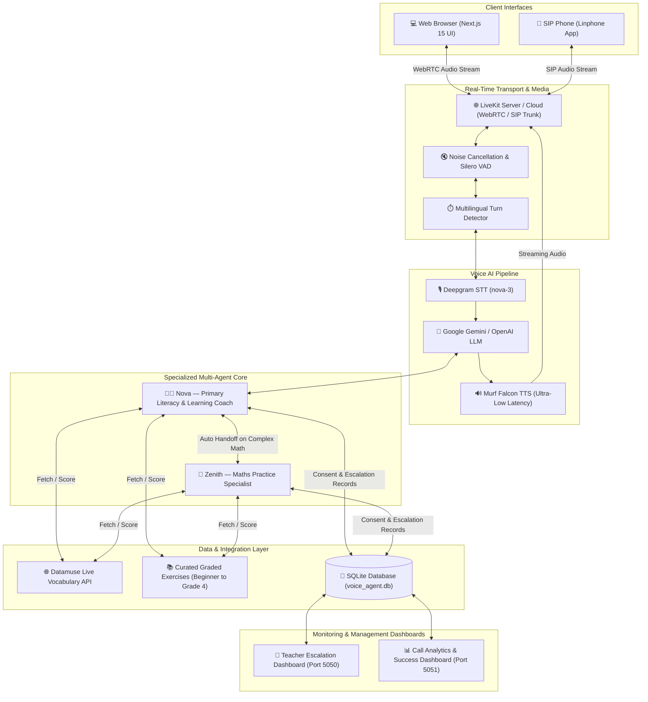

# 🎙️ Voice Agent Starter — Learning & Literacy AI

Build a production-grade, multi-agent voice AI companion in minutes. Powered by **[Murf Falcon](https://murf.ai/api/docs/text-to-speech/streaming)** — the fastest streaming Text-to-Speech engine on the market — and **[LiveKit Agents](https://docs.livekit.io/agents)**.

This repository features an end-to-end voice assistant equipped with **dynamic exercise generation**, **spoken answer evaluation**, **intelligent multi-agent handoffs (Nova & Zenith)**, **human teacher escalation workflows**, **real-time management dashboards**, and **SIP telephony outbound practice calling**.

[](https://opensource.org/licenses/MIT)
[](https://murf.ai/api/docs/text-to-speech/streaming)
[](https://docs.livekit.io)
[](https://nextjs.org/)
[](https://www.python.org/)
[](https://deepgram.com)
[](https://aistudio.google.com)

---

## ⚡ Why Murf Falcon

- **55ms model latency** — Industry-leading, ultra-fast streaming speech synthesis.
- **130ms time-to-first-audio (TTFA)** across 10+ global regions.
- **$0.01 / 1,000 characters** — Up to 10x more cost-effective than legacy TTS providers.
- **150+ natural voices** across 35+ languages and regional accents.
- **99.38% pronunciation accuracy** for crisp, natural educational conversations.

---

## 🏗️ Architecture



---

## 🌟 Key Features

### 1. 👩‍🏫 Nova — Literacy & Learning Companion
- **Dynamic Exercise Retrieval (`fetch_next_exercise`)**: Pulls real-time vocabulary, phonics, and reading exercises via the live [Datamuse API](https://api.datamuse.com/words) or local graded curriculum (`beginner`, `grade_1` through `grade_4`, `intermediate`, `advanced`).
- **Spoken Answer Scoring (`score_spoken_answer`)**: Computes character distance (Levenshtein), word overlap ratio, and phonetic similarity to provide real-time spoken feedback.
- **Out-Loud Failure Handling**: If an external API encounters a network timeout, Nova immediately announces the fallback out loud and transitions seamlessly to offline curriculum without hallucinating.
- **Multilingual Adaptability**: Seamlessly converses and switches between **English**, **Hindi**, and **Hinglish**.
- **Privacy & Consent Guardrail**: Mandatory verbal consent check before saving any learner facts (`save_caller_facts`).

### 2. 📐 Zenith — Dedicated Maths Practice Specialist
- **Automated Agent Handoff (`handoff_to_math_specialist`)**: When calculations exceed single-digit arithmetic or involve multi-step word problems, algebra, fractions, or times tables, Nova hands off the user directly to Zenith.
- **Speech-Optimized Math Formatting**: Formulates solutions strictly in natural spoken words (e.g., `"22 times 96 equals 2112"`), eliminating LaTeX delimiters and `$` symbols that cause TTS engines to say *"dollar"*.
- **Visual Handoff Indicator**: The frontend UI displays an active specialist badge and dedicated Zenith overlay whenever handoff occurs.

### 3. 🚨 Human Teacher Escalations
- **Strict Two-Condition Triggers**: Escalates only when the learner exhibits emotional distress/frustration or explicitly asks for a human teacher.
- **Verbal Consent Workflow**: Explains what information will be logged and requests user confirmation prior to calling `create_escalation`.
- **Teacher Escalation Dashboard (`http://localhost:5050`)**: Web portal for educators to review active escalations, learner language preferences, prior agent actions, and mark tickets as resolved.

### 4. 📊 Call Analytics Dashboard (`http://localhost:5051`)
- Real-time metrics on **Total Calls**, **Successful Calls**, **Failed Calls**, and **Success Rate**.
- Tracks **Exercises Attempted vs. Passed** with 5-second live auto-refresh.
- **Privacy-Preserving**: No sensitive personal data, OTPs, PINs, or conversation transcripts are exposed.

### 5. 📞 Daily Outbound Practice Calls (Linphone SIP)
- Scheduled outbound dialer via LiveKit SIP trunk (`make_outbound_call.py`).
- **Required Trust Greeting**: Immediately delivers a clear identity greeting and transparent opt-out instruction upon pickup.
- **Instant Opt-Out (`cancel_daily_calls`)**: Recognizes cancellation requests (*"cancel my calls"*, *"unsubscribe"*) and updates the database to prevent future calls.
- **Returning Caller Personalization**: Dynamically retrieves previous learning history (`lookup_caller`) to personalize follow-up sessions.

---

## 🚀 Quickstart

### Prerequisites

- **Python 3.10+**
- **[uv](https://docs.astral.sh/uv/)** — Ultra-fast Python package manager
  ```bash
  # macOS/Linux
  curl -LsSf https://astral.sh/uv/install.sh | sh

  # Windows (PowerShell)
  powershell -ExecutionPolicy ByPass -c "irm https://astral.sh/uv/install.ps1 | iex"
  ```
- **Node.js 18+** & **pnpm**
  ```bash
  npm install -g pnpm
  ```
- A **[LiveKit Cloud](https://cloud.livekit.io/)** project (or local `livekit-server`)
- API keys: **Murf Falcon**, **Deepgram**, and **Google Gemini** (or **OpenAI**)

---

### Step 1: Clone the Repository

```bash
git clone https://github.com/murf-ai/murf-livekit-starter.git
cd murf-livekit-starter
```

---

### Step 2: Configure Environment Variables

Create `.env.local` files in both `backend/` and `frontend/` (sample templates available in `.env.example`):

#### Backend (`backend/.env.local`)
```env
LIVEKIT_URL=wss://<your-project>.livekit.cloud
LIVEKIT_API_KEY=APIxxxxxxxxxxxx
LIVEKIT_API_SECRET=secretxxxxxxxxxxxxxxxxxxxxxxxxxxxxxxxx
MURF_API_KEY=your_murf_api_key
DEEPGRAM_API_KEY=your_deepgram_api_key
GOOGLE_API_KEY=your_gemini_api_key

# Optional: For Linphone SIP Outbound Calling
SIP_OUTBOUND_TRUNK_ID=ST_xxxxxxxxxxxx
LINPHONE_SIP_URI=sip:username@sip.linphone.org
```

#### Frontend (`frontend/.env.local`)
```env
LIVEKIT_URL=wss://<your-project>.livekit.cloud
LIVEKIT_API_KEY=APIxxxxxxxxxxxx
LIVEKIT_API_SECRET=secretxxxxxxxxxxxxxxxxxxxxxxxxxxxxxxxx
```

---

### Step 3: Install Dependencies & Download Models

```bash
# 1. Install backend dependencies and download models
cd backend
uv sync
uv run python src/agent.py download-files

# 2. Install frontend dependencies
cd ../frontend
pnpm install
```

---

### Step 4: Run the Application

#### Option A: One-Click Startup (Recommended)

From the project root:

```bash
# Windows (PowerShell)
.\start_app.ps1

# macOS / Linux
chmod +x start_app.sh
./start_app.sh
```

#### Option B: Manual Multi-Terminal Startup

```bash
# Terminal 1 — Backend Agent
cd backend && uv run python src/agent.py dev

# Terminal 2 — Frontend UI
cd frontend && pnpm dev

# Terminal 3 — Teacher Escalation Dashboard (Optional)
cd backend && uv run python src/escalation_dashboard.py

# Terminal 4 — Call Analytics Dashboard (Optional)
cd backend && uv run python src/call_analytics_dashboard.py

# Terminal 5 — Local LiveKit Server (If not using LiveKit Cloud)
livekit-server --dev
```

Once running:
- **Voice Agent UI**: Open [http://localhost:3000](http://localhost:3000)
- **Teacher Escalation Portal**: Open [http://localhost:5050](http://localhost:5050)
- **Call Analytics Dashboard**: Open [http://localhost:5051](http://localhost:5051)

---

## 🎯 Recommended Voice Test Prompts

Test all features by speaking to the voice agent:

| Category | What to Say | Expected Agent Action |
| :--- | :--- | :--- |
| **Fetch Exercise** | *"Can you give me a Grade 1 math exercise?"*<br>*"Give me a beginner reading practice question."* | Calls `fetch_next_exercise` and reads out the dynamic question. |
| **Score Spoken Answer** | *"My answer is 'hat'. How did I do?"*<br>*"The sun shines bright in the sky. Score my reading."* | Calls `score_spoken_answer`, checks phonetic accuracy, and announces score. |
| **Maths Handoff** | *"What is 22 times 96?"*<br>*"Can you help me solve 125 plus 340?"* | Nova announces handoff to **Zenith**, who introduces himself and solves the problem step-by-step. |
| **Multilingual** | *"Namaste Nova! Kya hum Hindi mein baat kar sakte hain?"* | Nova immediately switches to conversational Hindi/Hinglish. |
| **Human Escalation** | *"I'm getting really frustrated and I want to quit."*<br>*"Can I talk to a real teacher?"* | Nova empathizes, asks permission to log an escalation note, and triggers `create_escalation`. |
| **Data Privacy Consent** | End of conversation / *"Wrap up our practice."* | Nova asks: *"I'd like to remember your name {Name} and that we spoke about {Topic}. Is it okay if I save this?"* before calling `save_caller_facts`. |
| **Outbound SIP Opt-Out** | *"Cancel my daily calls."* / *"Unsubscribe."* | Nova calls `cancel_daily_calls`, confirms cancellation, and hangs up gracefully. |

---

## 📱 Daily Outbound SIP Practice Calls (Linphone)

The project includes an outbound SIP dialer that calls learners for scheduled practice sessions.

### Step-by-Step Setup

1. **Get a Free Linphone Account**:
   - Register at [subscribe.linphone.org](https://subscribe.linphone.org/).
   - Install the Linphone app on desktop or mobile and log in (`sip:<username>@sip.linphone.org`).
2. **Create LiveKit Outbound SIP Trunk**:
   - In [LiveKit Cloud](https://cloud.livekit.io) &rarr; **SIP** tab &rarr; **Create Outbound Trunk**.
   - Set **Address/Hostname** to `sip.linphone.org` and **Numbers** to `+0000000000`.
   - Copy the generated Trunk ID (`ST_xxxxxxxxxxxx`).
3. **Configure `.env.local`**:
   ```env
   SIP_OUTBOUND_TRUNK_ID=ST_xxxxxxxxxxxx
   LINPHONE_SIP_URI=sip:<username>@sip.linphone.org
   ```
4. **Trigger Outbound Call**:
   ```bash
   cd backend
   uv run python src/make_outbound_call.py
   ```
   Accept the incoming call on Linphone to start your practice session!

---

## ⚙️ Configuration & Customization

All core pipeline settings can be modified in [`backend/src/agent.py`](backend/src/agent.py) and [`backend/src/prompt.py`](backend/src/prompt.py).

### Murf Falcon Voice Selection

Change the `voice` parameter in `tts=murf.TTS(...)`:

```python
tts = murf.TTS(
    voice="Anisha",  # Indian English (Female, Default)
    # voice="Pooja",  # Indian English (Female)
    # voice="Samar",  # Indian English (Male)
    # voice="Amara",  # US English (Female)
    # voice="Gordon", # US English (Male)
    # voice="Hazel",  # UK English (Female)
    # voice="Bertie", # UK English (Male)
)
```
Explore the full list at the [Murf Voice Library](https://murf.ai/api/docs/voices-styles/voice-library).

### LLM & STT Models

- **LLM**: Default is Google Gemini (`google.LLM(model="gemini-2.5-flash")`). You can swap to `openai.LLM(model="gpt-4o-mini")`.
- **STT**: Default is Deepgram Nova-3 (`deepgram.STT(model="nova-3")`).

---

## 📁 Project Structure

```
voice-agent/
└── murf-livekit-starter/
    ├── backend/
    │   ├── src/
    │   │   ├── agent.py                    # Multi-agent entrypoint, session pipeline, function tools
    │   │   ├── prompt.py                   # Nova, Zenith, & Outbound system prompts and instructions
    │   │   ├── exercises.py                # Live Datamuse API integration & local graded curriculum
    │   │   ├── database.py                 # SQLite database schema, user profiles, escalations, call logs
    │   │   ├── escalation_dashboard.py     # Web UI server for teacher escalations (Port 5050)
    │   │   ├── call_analytics_dashboard.py # Web UI server for call stats & metrics (Port 5051)
    │   │   └── make_outbound_call.py       # Linphone SIP outbound dialing script
    │   ├── tests/
    │   │   ├── test_agent.py               # Unit tests for agent functions & prompts
    │   │   └── test_exercises.py           # Unit tests for scoring & exercise fetching
    │   ├── .env.example                    # Backend environment variable template
    │   ├── pyproject.toml                  # Python dependencies managed with uv
    │   └── README.md                       # Backend-specific documentation
    ├── frontend/
    │   ├── app/
    │   │   ├── page.tsx                    # Voice Agent main web page
    │   │   ├── layout.tsx                  # Root layout & theme providers
    │   │   └── api/token/route.ts          # LiveKit access token generation endpoint
    │   ├── components/
    │   │   ├── app/
    │   │   │   ├── view-controller.tsx     # Session orchestrator & Zenith handoff detection
    │   │   │   ├── zenith-overlay.tsx      # Specialist takeover visualizer
    │   │   │   └── welcome-view.tsx        # Pre-connect interface
    │   │   └── agents-ui/                  # Audio visualizers, transcripts, & controls
    │   ├── app-config.ts                   # Branding, accent colors, and app strings
    │   ├── package.json                    # Node.js dependencies
    │   └── README.md                       # Frontend-specific documentation
    ├── start_app.ps1                       # Windows one-click startup script
    ├── start_app.sh                        # macOS/Linux one-click startup script
    └── README.md                           # Master project documentation
```

---

## 🧪 Testing

Run backend tests using `pytest`:

```bash
cd backend
uv run pytest
```

---

## 🚢 Deployment

### Backend (Python Agent) &rarr; [Railway](https://railway.com/)

1. Push your repository to GitHub.
2. Create a new service on Railway connected to your repository (set Root Directory to `/backend`).
3. Set all required environment variables (`MURF_API_KEY`, `DEEPGRAM_API_KEY`, `GOOGLE_API_KEY`, `LIVEKIT_URL`, `LIVEKIT_API_KEY`, `LIVEKIT_API_SECRET`).
4. Start command: `uv run python src/agent.py start`.

### Frontend (Next.js) &rarr; [Vercel](https://vercel.com/)

1. Import your repository on Vercel (set Root Directory to `/frontend`).
2. Set environment variables: `LIVEKIT_URL`, `LIVEKIT_API_KEY`, `LIVEKIT_API_SECRET`, and `AGENT_NAME=my-agent`.
3. Deploy!

---

## 🔗 Useful Links & Resources

- [Murf AI API Documentation](https://murf.ai/api/docs)
- [Murf Falcon Benchmarks](https://murf.ai/falcon/benchmarks)
- [Murf Streaming TTS API Reference](https://murf.ai/api/docs/text-to-speech/streaming)
- [LiveKit Agents Documentation](https://docs.livekit.io/agents)
- [Deepgram Speech-to-Text Docs](https://developers.deepgram.com)
- [Datamuse Public Educational API](https://www.datamuse.com/api/)
- [Murf Discord Community](https://discord.gg/FbKAy96Sz7)

---

## 📄 License

This project is licensed under the [MIT License](LICENSE).
